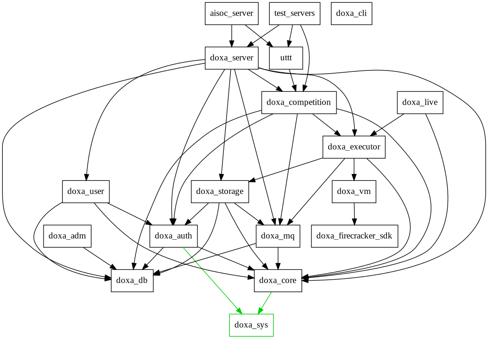

# DOXA 🧠 

A customisable platform for creating fully automated AI competitions.

Features:
- 🔐 Secure: every agent in run in a private [firecracker](https://github.com/firecracker-microvm/firecracker/) micro-vm without internet access and limited memory meaning it's possible to securely run user submitted code.
- 🚀 Fast: the backend is written entirely in rust with a focus on speed, when rate limiting is disabled it's possible for a user's agent to be running in a VM and playing matches within seconds of upload.
- 🔩 Resilient: actions such as match requests and agent activations are stored in Rabbit MQ persistant queues 
- 🔧 Customisable: the core of DOXA makes very few assumptions about competitions while providing convenience features for common functionality, e.g. if you don't need a leaderboard for a competition you can disable it.

### Current Status 🚧

DOXA is currently in ALPHA.
It is possible to write custom competitions and run them but there are many features currently missing.
Some of these missing features may constitute security concerns.

Additionally although DOXA is designed to be a generic platform, it's first usecase is for the [UCL AI Society](https://uclaisociety.co.uk).
Currently some code in the repo is specific to that usecase (primarily the UI and the URL specific in the CLI tool `doxa_cli`).

## Competition design

Here is a diagram showing how the competition fits into the system (note this is a simplified diagram):

An example hello world competition is in [crates/doxa_competition/src/hello_world.rs](crates/doxa_competition/src/hello_world.rs). You can also view a real world competition by looking in the competitions folder.

## Server Components

DOXA (the backend server) is made up of several components (crates) which can be found in the `crates` folder.

### `doxa_server`

Provides useful boilerplate to easily setup a new deployment of DOXA.

### `uttt`

An implementation of an ulimate tic tac toe competition for UCL AI Society, which is in the `competitions` folder.

### `doxa_sys`

A util crate that contains proc macros. `doxa_core` imports this and other crates can consume `doxa_sys` through that.

### `doxa_core`

Contains common trait definitions particularly with regards to error handling. For example a `RespondableError` provides a convenient way for errors to be securely (without leaking internal data) mapped to HTTP error responses.

### `doxa_auth`

Provides HTTP routes and common util code for authenticating users.

### `doxa_user`

Provides HTTP routes endpoints useful to managing users.

### `doxa_storage`

Provides HTTP routes for uploading and downloading agents.

### `doxa_db`

Contains the database definition along with models and actions for all the different parts of DOXA.

### `doxa_mq`

Contains actions for interactive with rabbit mq.

### `doxa_adm`

A CLI tool that connects directly to the database for performing admin actions. This is packaged with the server docker container at `/app/doxa_adm`.

### `doxa_cli`

A CLI tool for users that makes use of the public HTTP API. It currently does not have a single cargo dependency on any other DOXA component as it interacts with the system entirely through API calls.

### `doxa_firecracker_sdk`

A library that could easily be extracted from DOXA to an independent project for managing firecracker VMs. It allows for spawning a VM process then sending commands over it's socket in a convenient way.

### `doxa_vm`

Contains a program (binary) that's designed to run inside the VM which manages the lifecycle of the agent including processing input and output. This is also exposed as a library that manages communication with that manager over a VSOCK. This library only has concepts of spawning agents, processing STDIN and STDOUT and restarting agents.

### `doxa_executor`

Provides the definition of a `GameClient` that competitions can implement and provides a way for running a match including downloading the agents.

### `doxa_competition`

Provides the definition of a `Competition` trait that can be implemented. This also contains several managers for different aspects such as agent activation and match scheduling.

### `doxa_live` 🚧

This is a WIP component which should allow for users to play against a particular agent using a websocket.

